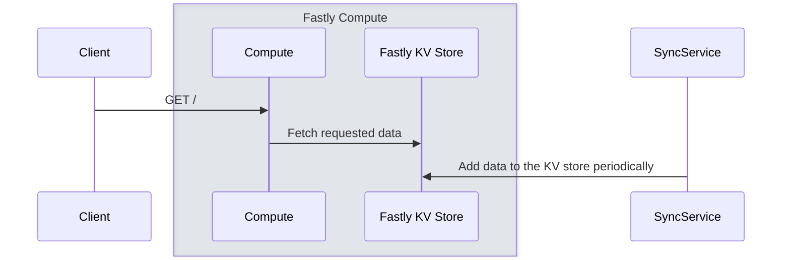

# ⚡ Fastly Pokémon KV Project

This project demonstrates how to use Fastly's KV Store to store and sync Pokémon data using two components:

- **`sync-service/`** — A Node.js service that periodically syncs Pokémon data to a Fastly KV store using cron jobs.
- **`fastly-compute/`** — A Fastly Compute@Edge application that can interact with the KV store (e.g. fetch Pokémon data for display or API use).

## Diagram



## 📁 Project Structure

```
.
├── fastly-compute     # Fastly Compute@Edge app (e.g., serving KV data)
└── sync-service       # Node.js app that syncs Pokémon data to the Fastly KV store
```


## 🔧 Requirements

- [Node.js](https://nodejs.org/) (for `sync-service`)
- [Fastly CLI](https://developer.fastly.com/reference/cli/) (for both components)
- A [Fastly account](https://www.fastly.com/) with access to KV Store and Compute@Edge


## 🧬 Getting Started

### 1. Clone the repo

```bash
git clone https://github.com/your-username/your-repo-name.git
cd your-repo-name
```

### 2. Set up the sync service

Navigate to the `sync-service/` directory and follow the instructions in its [README](./sync-service/README.md) to:

- Create a KV store
- Add your API key
- Sync base data to the store
- Start the cron sync job

### 3. Set up the Fastly Compute app

Navigate to `fastly-compute/` and deploy the Compute@Edge service. This app can read from the same KV store created earlier.

---

## 🧠 Use Cases

- Learning how to interact with Fastly’s KV API programmatically
- Demonstrating edge compute and data syncing
- Building a fun, data-driven demo using Pokémon


## 💡 Tip

Use `fastly kv-store --help` and `fastly compute --help` to explore all the CLI options available.

